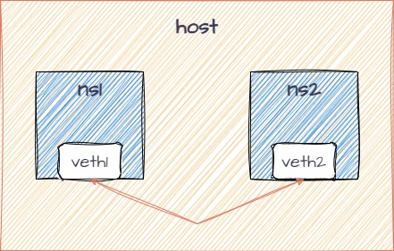
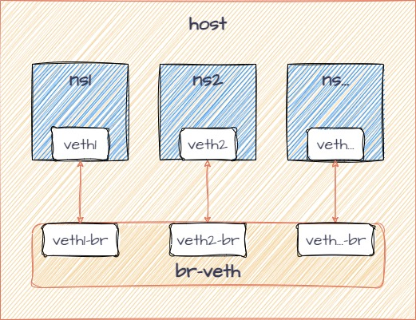

veth 接口
================================================================================

Namespace 技术带来了隔离功能，也引入了新的问题，NS 如何高效的互通和访问外网。

.. todo::

    * 说明 Namespace 的实现原理
    * veth 的实现是 MAC 向 PHY 转发报文时，直接发向对端的 MAC

NS 互通
--------------------------------------------------------------------------------

.. code-block::

    # 添加 network namespace
    sudo ip netns add ns1
    sudo ip netns add ns2

    # 创建 veth
    sudo ip link add veth1 type veth peer name veth2

    # 放入 ns1 并配置参数
    sudo ip link set veth1 netns ns1
    sudo ip netns exec ns1 ip addr add 10.1.1.1/24 dev veth1
    sudo ip netns exec ns1 ip link set veth1 up

    # 放入 ns2 并配置参数
    sudo ip link set veth2 netns ns2
    sudo ip netns exec ns2 ip addr add 10.1.1.2/24 dev veth2
    sudo ip netns exec ns2 ip link set veth2 up

.. code-block::

    ~$ sudo ip netns exec ns2 ping 10.1.1.1
    PING 10.1.1.1 (10.1.1.1) 56(84) bytes of data.
    64 bytes from 10.1.1.1: icmp_seq=1 ttl=64 time=0.038 ms
    64 bytes from 10.1.1.1: icmp_seq=2 ttl=64 time=0.034 ms
    ^C
    --- 10.1.1.1 ping statistics ---
    2 packets transmitted, 2 received, 0% packet loss, time 1024ms
    rtt min/avg/max/mdev = 0.034/0.036/0.038/0.002 ms

veth 和 bridge
--------------------------------------------------------------------------------

.. code-block::

    # 添加 bridge 并 bring-up
    sudo ip link add br0 type bridge
    sudo ip link set br0 up

    # 添加 ns
    sudo ip netns add ns3
    sudo ip netns add ns4

    # 添加 veth
    sudo ip link add veth3 type veth peer name veth3-br
    sudo ip link add veth4 type veth peer name veth4-br

    # 放入 bridge 并 bring-up
    sudo ip link set veth3-br master br0
    sudo ip link set veth3-br up

    # 放入 bridge 并 bring-up
    sudo ip link set veth4-br master br0
    sudo ip link set veth4-br up

    # 放入 ns 并配置参数
    sudo ip link set veth3 netns ns3
    sudo ip netns exec ns3 ip addr add 10.1.1.3/24 dev veth3
    sudo ip netns exec ns3 ip link set veth3 up

    # 放入 ns 并配置参数
    sudo ip link set veth4 netns ns4
    sudo ip netns exec ns4 ip addr add 10.1.1.4/24 dev veth4
    sudo ip netns exec ns4 ip link set veth4 up

.. code-block::

    ~$ sudo ip netns exec ns4 ping 10.1.1.3
    PING 10.1.1.3 (10.1.1.3) 56(84) bytes of data.
    64 bytes from 10.1.1.3: icmp_seq=1 ttl=64 time=0.042 ms
    64 bytes from 10.1.1.3: icmp_seq=2 ttl=64 time=0.051 ms
    ^C
    --- 10.1.1.3 ping statistics ---
    2 packets transmitted, 2 received, 0% packet loss, time 1039ms
    rtt min/avg/max/mdev = 0.042/0.046/0.051/0.004 ms

.. code-block::

    # ping 失败，建议添加转发
    sudo sysctl -w net.ipv4.ip_forward=1
    sudo iptables -A FORWARD -i br0 -o br0 -j ACCEPT

.. code-block::

    # 联通外网
    sudo ip addr add 10.1.1.1/24 dev br0

    sudo iptables -A FORWARD -i br0 -j ACCEPT
    sudo iptables -A FORWARD -o br0 -j ACCEPT

    sudo ip netns exec ns3 ip route add default via 10.1.1.1
    sudo ip netns exec ns4 ip route add default via 10.1.1.1

    sudo iptables --table nat -A POSTROUTING -s 10.1.1.0/24 ! -o br0 -j MASQUERADE

.. code-block::

    ~$ sudo ip netns exec ns3 ping 8.8.8.8
    PING 8.8.8.8 (8.8.8.8) 56(84) bytes of data.
    64 bytes from 8.8.8.8: icmp_seq=1 ttl=111 time=31.8 ms
    64 bytes from 8.8.8.8: icmp_seq=2 ttl=111 time=30.5 ms
    ^C
    --- 8.8.8.8 ping statistics ---
    2 packets transmitted, 2 received, 0% packet loss, time 1010ms
    rtt min/avg/max/mdev = 30.485/31.133/31.781/0.648 ms

恢复 ns
--------------------------------------------------------------------------------

建议虚拟机操作，直接重启，或者使用以下命令

.. code-block::

    sudo ip -n ns1 link set netns 1 dev veth1
    sudo ip -n ns2 link set netns 1 dev veth2
    sudo ip -n ns3 link set netns 1 dev veth3
    sudo ip -n ns4 link set netns 1 dev veth4
    sudo ip link delete veth1
    sudo ip link delete veth3
    sudo ip link delete veth4
    sudo ip netns del ns1
    sudo ip netns del ns2
    sudo ip netns del ns3
    sudo ip netns del ns4
    sudo ip link del dev br0
    sudo iptables -D FORWARD -i br0 -o br0 -j ACCEPT
    sudo iptables -D FORWARD -i br0 -j ACCEPT
    sudo iptables -D FORWARD -o br0 -j ACCEPT
    sudo iptables -t nat -D POSTROUTING -s 10.1.1.0/24 ! -o br0 -j MASQUERADE
