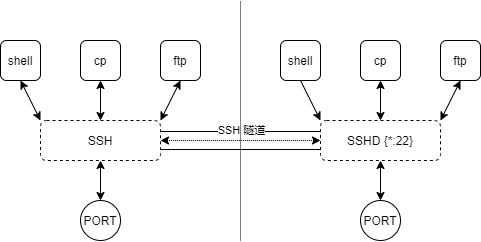
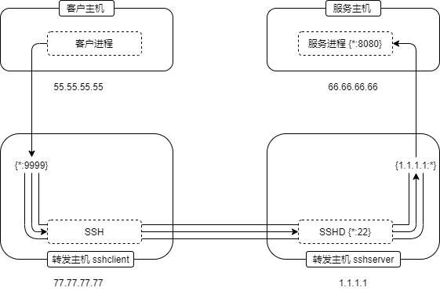

SSH 端口转发
==================================================

概述
--------------------------------------------------

回顾开篇， *ssh* 创建了一条隧道，允许数据在其中传输:

如果本地 ssh 和远程 sshd 各创建一个端口，用于收发数据，那就可以实现任意数据的转发。

网络参数
--------------------------------------------------

在介绍转发前，先说明一些网络编程的概念，下表列出了 ssh 端口转发所涉及的地址:

======== ========== ===================== ===================
IP版本    通配地址    回环地址（本地地址)    指定地址
-------- ---------- --------------------- -------------------
IPv4      0.0.0.0    127.0.0.1/localhost   合法 IPv4 单播地址
IPv6      [::0]      [::1]                 合法 IPv6 单播地址
======== ========== ===================== ===================

* `*` 表示 IPv4 和 IPv6 地址，理论上本地地址无所谓 IPv4 和 IPv6。
* IPv6 地址很长，使用 :: 代表补足 128 bit 的 0，有时还使用 [] 包裹，详见 IPv6 协议。

假设主机有如下地址（数据合理性未考虑，只是为了说明数据传入情况）:

.. code-block:: none

    0.0.0.0                     # 通配地址，实际不存在
    [::0]                       # 通配地址，实际不存在
    127.0.0.1/localhost         # 回环地址，IPv4 地址，位于 lo 接口
    [::1]                       # 回环地址，IPv6 地址，位于 lo 接口
    10.0.0.1                    # IPv4 地址，位于 eth0 接口
    192.168.1.10                # IPv4 地址，位于 eth0 接口
    192.168.2.10                # IPv4 地址，位于 eth1 接口
    400::1                      # IPv6 地址，位于 eth0 接口
    200::1                      # IPv6 地址，位于 eth0 接口
    300::1                      # IPv6 地址，位于 eth0 接口

* 通配地址: 表示允许任意地址接入

.. code-block:: bash

    0.0.0.0             # 数据可以从任意一个 IPv4 地址传入，包括回环地址，也不区分接口
    [::0]               # 数据可以从任意一个 IPv6 地址传入，包括回环地址，也不区分接口
    *                   # 数据可以从任意一个地址传入，包括回环地址，也不区分接口

* 回环地址: 表示只允许本地地址连入

.. code-block:: bash

    127.0.0.1/localhost # 数据只能从该地址传入，也就是本机 IPv4 数据
    [::1]               # 数据只能从该地址传入，也就是本机 IPv6 数据

* 指定地址: 表示只允许指定地址连入

.. code-block:: bash

    10.0.0.1            # 数据只能从该地址传入,也就是 eth0 接口, 10.0.0.1 地址
    192.168.1.10        # 数据只能从该地址传入,也就是 eth0 接口, 192.168.1.10 地址
    192.168.2.10        # 数据只能从该地址传入,也就是 eth1 接口, 192.168.2.10 地址
    400::1              # 数据只能从该地址传入,也就是 eth0 接口, 400::1 地址
    200::1              # 数据只能从该地址传入,也就是 eth0 接口, 200::1 地址
    300::1              # 数据只能从该地址传入,也就是 eth1 接口, 300::1 地址

备注:此处不考虑 IPv4 与 IPv6 的互操作性，也就是两者严格区分，详见 《unix 网络编程》。

转发选项
--------------------------------------------------

端口转发时，往往和以下三个选项组合使用。

-f
    后台运行
-N
    不执行远程命令
-C
    压缩数据

本地转发 (-L)
--------------------------------------------------

本地转发就是本地主机收到的数据通过远程主机转到目的地址，上图对应的命令如下:

.. code-block:: bash

    ssh -fCNL 0.0.0.0:9999:4.4.4.4:8080 sshserver@3.3.3.3

对应格式为 *-L [bind_address:]port:host:hostport* 。

如果只是本机数据转发，则可以减少地址范围:

.. code-block:: bash

    ssh -fCNL 9999:4.4.4.4:8080 sshserver@3.3.3.3               # 默认只允许本机转发
    ssh -fCNL 127.0.0.1:9999:4.4.4.4:8080 sshserver@3.3.3.3

UNIX 域套接字也属于网络范畴，因此也可作为监听地址或目的地址，完整的帮助信息如下:

.. code-block:: bash

    -L [bind_address:]port:host:hostport
    -L [bind_address:]port:remote_socket
    -L local_socket:host:hostport
    -L local_socket:remote_socket

动态转发 (-D)
--------------------------------------------------

本地转发需要确立目的地址，然后手动维护转发规则，这难以应对目的地址过多或变动的情况。动态转发会根据目的地址自动维护转发规则，只需绑定本地地址。

.. image:: ssh_image/dynamic_port_forwarding.png

帮助信息:

.. code-block:: bash

    -D [bind_address:]port

举例:

.. code-block:: bash

    ssh -D           9999 sshserver     # 绑定 IPv4 本地地址，由 sshserver 转发数据
    ssh -D 127.0.0.1:9999 sshserver     # 绑定 IPv4 本地地址，由 sshserver 转发数据
    ssh -D   0.0.0.0:9999 sshserver     # 绑定 IPv4 通配地址，由 sshserver 转发数据
    ssh -D     [::0]:9999 sshserver     # 绑定 IPv6 通配地址，由 sshserver 转发数据

未确认信息: 动态转发为 socks5 代理，数据带有目的地址，sshd 根据目的地址自动维护转发规则。

远程转发 (-R)
--------------------------------------------------

.. image:: ssh_image/remote_port_forwarding.png

远程转发就是远程主机收到的数据通过本地主机转到目的地址，工作原理如下:

示例命令:

.. code-block:: bash

    -R [bind_address:]port:host:hostport
    -R [bind_address:]port:local_socket
    -R remote_socket:host:hostport
    -R remote_socket:local_socket

举例:

.. code-block:: bash

    ssh -R 9999:localhost:8080 user@sshserver

自动重连
--------------------------------------------------

yum install autossh

autossh -M 7281 -fCNR 7280:localhost:22 root@123.123.123.123

最核心的不同在于代理的对象不同。

    正向代理是代理客户端

    。反向代理是代理服务器。

而根据这核心的区别，我们也可以记住：代理哪端便可以隐藏哪端。

也就是说：

    正向代理隐藏真实客户端反向代理隐藏真实服务端
