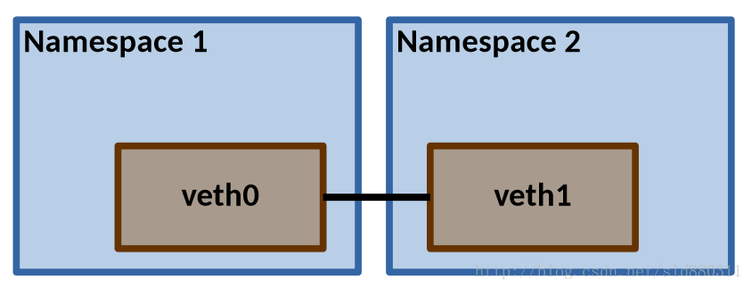
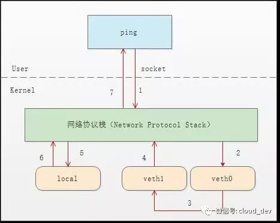
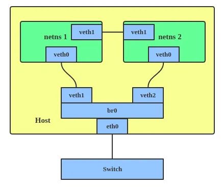

Linux veth pair 详解
================================================================================

参考文档：

* https://blog.kubesimplify.com/docker-networking-demystified

.. code-block::

    sudo ip link add veth1 type veth peer name veth2
    sudo ip addr add 10.1.1.1/24 dev veth1
    sudo ip addr add 10.1.1.2/24 dev veth2

由于内核配置，跳过该步骤，直接用下一条命令无法 ping 通

.. code-block::

    # 提前备份
    # sudo 直接操作是 echo 有 sudo 权限，而不是重定向
    sudo sh -c "echo 1 > /proc/sys/net/ipv4/conf/veth1/accept_local"
    sudo sh -c "echo 1 > /proc/sys/net/ipv4/conf/veth2/accept_local"
    sudo sh -c "echo 0 > /proc/sys/net/ipv4/conf/all/rp_filter"
    sudo sh -c "echo 0 > /proc/sys/net/ipv4/conf/veth1/rp_filter"
    sudo sh -c "echo 0 > /proc/sys/net/ipv4/conf/veth2/rp_filter"

    # 切换 root 用户执行
    sudo su
    echo 1 > /proc/sys/net/ipv4/conf/veth1/accept_local
    echo 1 > /proc/sys/net/ipv4/conf/veth2/accept_local
    echo 0 > /proc/sys/net/ipv4/conf/all/rp_filter
    echo 0 > /proc/sys/net/ipv4/conf/veth1/rp_filter
    echo 0 > /proc/sys/net/ipv4/conf/veth2/rp_filter

.. code-block::

    ~$ ping -I veth2 10.1.1.1 -c 2
    PING 10.1.1.1 (10.1.1.1) from 10.1.1.2 veth2: 56(84) bytes of data.
    From 10.1.1.2 icmp_seq=1 Destination Host Unreachable
    From 10.1.1.2 icmp_seq=2 Destination Host Unreachable

    --- 10.1.1.1 ping statistics ---
    2 packets transmitted, 0 received, +2 errors, 100% packet loss, time 1037ms
    pipe 2

扩展内容
--------------------------------------------------------------------------------

报文流动如图，因此在两个 veth 接口都只能抓到请求报文，在 lo 接口可以抓到响应报文。

TODO:

* skb strace 查看
* mac80211_hwsim 也有类似的情况

veth 与 netns
--------------------------------------------------------------------------------

.. code-block::

    # 添加 ns
    sudo ip netns add ns1
    sudo ip netns add ns2

    # 添加 veth，此处复用上节的接口
    # sudo ip link add veth1 type veth peer name veth2

    # 放入 ns 并配置参数
    sudo ip link set veth1 netns ns1
    sudo ip netns exec ns1 ip addr add 10.1.1.1/24 dev veth1
    sudo ip netns exec ns1 ip link set veth1 up

    # 放入 ns 并配置参数
    sudo ip link set veth2 netns ns2
    sudo ip netns exec ns2 ip addr add 10.1.1.2/24 dev veth2
    sudo ip netns exec ns2 ip link set veth2 up

.. code-block::

    ~$ sudo ip netns exec ns2 ping 10.1.1.1
    PING 10.1.1.1 (10.1.1.1) 56(84) bytes of data.
    64 bytes from 10.1.1.1: icmp_seq=1 ttl=64 time=0.038 ms
    64 bytes from 10.1.1.1: icmp_seq=2 ttl=64 time=0.034 ms
    ^C
    --- 10.1.1.1 ping statistics ---
    2 packets transmitted, 2 received, 0% packet loss, time 1024ms
    rtt min/avg/max/mdev = 0.034/0.036/0.038/0.002 ms

bridge
--------------------------------------------------------------------------------

.. code-block::

    # 添加 bridge 并 bring-up
    sudo ip link add br0 type bridge
    sudo ip link set br0 up

    # 添加 ns
    sudo ip netns add ns3
    sudo ip netns add ns4

    # 添加 veth
    sudo ip link add veth3 type veth peer name br-veth3
    sudo ip link add veth4 type veth peer name br-veth4

    # 放入 bridge 并 bring-up
    sudo ip link set br-veth3 master br0
    sudo ip link set br-veth3 up

    # 放入 bridge 并 bring-up
    sudo ip link set br-veth4 master br0
    sudo ip link set br-veth4 up

    # 放入 ns 并配置参数
    sudo ip link set veth3 netns ns3
    sudo ip netns exec ns3 ip addr add 10.1.1.3/24 dev veth3
    sudo ip netns exec ns3 ip link set veth3 up

    # 放入 ns 并配置参数
    sudo ip link set veth4 netns ns4
    sudo ip netns exec ns4 ip addr add 10.1.1.4/24 dev veth4
    sudo ip netns exec ns4 ip link set veth4 up

.. code-block::

    # ping 失败，建议添加转发
    iptables -A FORWARD -i br0 -o br0 -j ACCEPT

.. code-block::

    ~$ sudo ip netns exec ns4 ping 10.1.1.3
    PING 10.1.1.3 (10.1.1.3) 56(84) bytes of data.
    64 bytes from 10.1.1.3: icmp_seq=1 ttl=64 time=0.042 ms
    64 bytes from 10.1.1.3: icmp_seq=2 ttl=64 time=0.051 ms
    ^C
    --- 10.1.1.3 ping statistics ---
    2 packets transmitted, 2 received, 0% packet loss, time 1039ms
    rtt min/avg/max/mdev = 0.042/0.046/0.051/0.004 ms

联通外网

.. code-block::

    sudo ip addr add 10.1.1.1/16 dev br0

    sudo ip netns exec ns3 ip route add default via 10.1.1.1
    sudo ip netns exec ns4 ip route add default via 10.1.1.1

    sudo iptables --table nat -A POSTROUTING -s 10.1.1.0/24 ! -o br0 -j MASQUERADE

.. code-block::

    ~$ sudo ip netns exec ns3 ping 8.8.8.8
    PING 8.8.8.8 (8.8.8.8) 56(84) bytes of data.
    64 bytes from 8.8.8.8: icmp_seq=1 ttl=111 time=31.8 ms
    64 bytes from 8.8.8.8: icmp_seq=2 ttl=111 time=30.5 ms
    ^C
    --- 8.8.8.8 ping statistics ---
    2 packets transmitted, 2 received, 0% packet loss, time 1010ms
    rtt min/avg/max/mdev = 30.485/31.133/31.781/0.648 ms

回到默认 netns
--------------------------------------------------------------------------------

建议虚拟机操作，直接重启，iptables 能力与需求尚不匹配

.. code-block::

    sudo ip -n ns1 link set netns 1 dev veth1
    sudo ip -n ns2 link set netns 1 dev veth2
    sudo ip -n ns3 link set netns 1 dev veth3
    sudo ip -n ns4 link set netns 1 dev veth4
